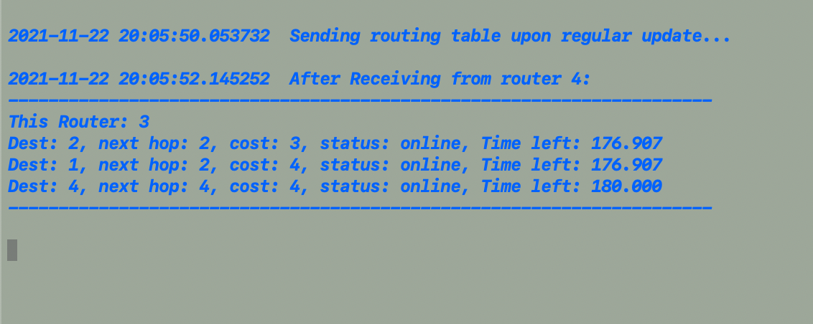

# RIP_router_daemon
Routering daemon implementing Simplified [Routing Information Protocol](https://datatracker.ietf.org/doc/html/rfc2453) (RIPv2), </br>Features such as split horizon with poisoned reverse are implemented.

*Note: We use different port number instead of IP address to simulate different routers.*


## Prerequisite
Please make sure [Python3](https://www.python.org/downloads/) is installed.


## Configuration file
Every router has a unique configuration file and unique router id.
Its input ports should be distinct as well because this simulates differet address. The same reason applies to outputs, which is the input ports of its neighbors. Please see example below.

**General Sytax:**
```
router-id <router-identifier>
input-ports <port_number1>, <port_number2>, ...
outputs <peer_input_port>-<metric>-<peer_router_id>, ...
```

*Note: Configuration file allows empty lines and spaces, but it needs to use keywords 'router-id', 'input-ports' and 'outputs', comments followed by '#' will be ignored.*


## Run
It doesn't matter which router is up first, this algorithm accommodates the real world situation. A router can be down (offline) and up (online) again.<br>

*Please remember to supply a router configuration file.*</br>
*Example of starting router 1, 2, 3:*
```
$python3 daemon.py router1
```
```
$python3 daemon.py router2
```
```
$python3 daemon.py router3
```


## Convergence
According to [RFC2453](https://datatracker.ietf.org/doc/html/rfc2453), the periodic update time is 30 seconds. Timeout when a router is offline is 180 seconds. Garbage collection timer is 120 seconds. Its corresponding timer is implemented following this RFC specification. Therefore, please wait for sufficient time allowing its convergence.

## Example


(Configuration file of router 1)


(Running router1 configuration file)


(Running router2 configuration file)



(Running router3 configuration file)
